# Docker

## Content

-   What is Docker?
-   Docker terminologies
-   Docker installation
-   Docker Commands
-   Debugging a container
-   Docker in practice
-   Developing with containers
-   Docker Compose - will it be in cloud run ?
-   Dockerfile - custom docker image
-   Docker repository - Google Container Registry
-   Deploy the containerized app on cloud run 
-   cloud run tutorial 

## What is Docker?

Docker is an open-source platform designed to automate the deployment, scaling, and management of applications using containerization. 

Containers allow developers to package an application along with its dependencies and configuration files into a single, portable unit that can run consistently across different environments.

## Docker terminologies

### Containers
Containers are lightweight, stand-alone, and executable software packages that include everything needed to run a piece of software, including the code, runtime, libraries, and system tools. They are isolated from each other and the host system, ensuring that the application behaves the same regardless of where it is run.

### Docker Engine
The core of Docker, Docker Engine is the runtime that builds and runs containers. It is responsible for creating, running, and managing Docker containers on a host system.

### Docker Hub [Container Repository]
A cloud-based registry service that allows you to find and share container images with your team. You can use Docker Hub to host your own container images and make them available to others. It can be private too, if needed.

### Docker Compose
A tool for defining and running multi-container Docker applications. With Compose, you can use a YAML file to configure your application’s services and create and start all the services from that configuration with a single command.

## Difference between Docker container and Docker image
### Docker Image 
-   In simple term it is a blueprint for creating Docker Container
-   It is a read-only template that includes everything needed to run a piece of software, such as code, runtime, libraries etc
-   it is static in nature, once created, it does not change during the run cycle
### Docker Container
-   It is a running environment/instance of a Docker Image
-   It has all the necessary stuff to run a software, such as file system, environment configuration etc.
-   It has port binded to it, which facilitate external communication to the application running inside the container


## Docker Engine installation

-   Run the following command to uninstall all conflicting packages [ignore if docker never installed on machine]
```sh
for pkg in docker.io docker-doc docker-compose docker-compose-v2 podman-docker containerd runc; do sudo apt-get remove $pkg; done
```
-   set up docker apt repository
```sh
# Add Docker's official GPG key:
sudo apt-get update
sudo apt-get install ca-certificates curl
sudo install -m 0755 -d /etc/apt/keyrings
sudo curl -fsSL https://download.docker.com/linux/ubuntu/gpg -o /etc/apt/keyrings/docker.asc
sudo chmod a+r /etc/apt/keyrings/docker.asc

# Add the repository to Apt sources:
echo \
  "deb [arch=$(dpkg --print-architecture) signed-by=/etc/apt/keyrings/docker.asc] https://download.docker.com/linux/ubuntu \
  $(. /etc/os-release && echo "$VERSION_CODENAME") stable" | \
  sudo tee /etc/apt/sources.list.d/docker.list > /dev/null
sudo apt-get update
```
-   Install docker packages
```sh
sudo apt-get install docker-ce docker-ce-cli containerd.io docker-buildx-plugin docker-compose-plugin
```
-   verify docker installation : This command downloads a test image and runs it in a container. When the container runs, it prints a confirmation message and exits.
```sh
sudo docker run hello-world
```

## Docker commands
-   Pulling the image from dockerhub repository [eg. redis]
-   Dockerhub : https://hub.docker.com/
```sh
sudo docker pull redis
```
-   To check exisisting images on your machine 
```sh
sudo docker images
```
-   To remove the docker image from the machine
```sh
sudo docker rm [stopped container id]
```
```sh
sudo docker rmi [IMAGE ID]
```
-   To run the image in a container [run it in new terminal window]
```sh
sudo docker run redis
```
-   To see running containers
```sh
sudo docker ps
```
-   Output of above command
```sh
CONTAINER ID   IMAGE     COMMAND                  CREATED         STATUS         PORTS      NAMES
533f1079b098   redis     "docker-entrypoint.s…"   6 seconds ago   Up 4 seconds   6379/tcp   exciting_ride
```
-   to run the container in detached mode
```sh
sudo docker run -d redis
```
-   to stop/start the container
```sh
sudo docker stop [CONTAINER ID]
sudo docker start [CONTAINER ID]
```

## Container ports and Port bindings
-   What happen when I run two redis containers using:  ```docker run redis``` twice
```sh
:~$ sudo docker ps

CONTAINER ID   IMAGE     COMMAND                  CREATED          STATUS          PORTS      NAMES
3106721e4fd9   redis     "docker-entrypoint.s…"   4 seconds ago    Up 4 seconds    6379/tcp   trusting_tu
533f1079b098   redis     "docker-entrypoint.s…"   18 minutes ago   Up 18 minutes   6379/tcp   exciting_ride
```
-   Here you can see the ports on which redis is listening is same : ```6379/tcp``` to avoid conflict between two port listening to the same port, the host port needed to be bind correctly, so that requests can be diverted to the appropreate container. [stop all the running container for next step]

- specifying port binding during start of the container ```d``` for detached mode, ```p1234``` host port, ```6379``` is a port on which redis container is listening [check result of first point of this section]
```sh
sudo docker run -d -p1234:6379 redis
```
-   In following snippet you can see the ports section
```sh
sudo docker ps
CONTAINER ID  IMAGE  COMMAND                 CREATED        STATUS        PORTS                                       NAMES
c00ce3c0d75b  redis  "docker-entrypoint.s…"  2 minutes ago  Up 2 minutes  0.0.0.0:1234->6379/tcp, :::1234->6379/tcp   priceless
```
-   Now run another redis container as follow 
```sh
sudo docker run -d -p9999:6379 redis
```
-   Now I have two redis container running and listening to the two different host port, which were specify when container were started
```sh
sudo docker ps

CONTAINER ID   IMAGE  COMMAND                  CREATED         STATUS         PORTS                                       NAMES
e665ded6ab67   redis  "docker-entrypoint.s…"   8 seconds ago   Up 7 seconds   0.0.0.0:9999->6379/tcp, :::9999->6379/tcp   wizardly
c00ce3c0d75b   redis  "docker-entrypoint.s…"   8 minutes ago   Up 8 minutes   0.0.0.0:1234->6379/tcp, :::1234->6379/tcp   engelbar
```

## Debugging a container
-   To get the logs of perticular container
```sh
docker logs [CONTAINER ID] 
or
docker logs [container name]
```
-   To provide custom container name
```sh
sudo docker run --name [customName nameOfImage]
```
-   Get the terminal of particular container [accessing the container]
```sh
sudo docker exec -it [CONTAINER ID] /bin/bash 
or
sudo docker exec -it [CONTAINER Name] /bin/bash
```
-   ```exit``` to exit the terminal
-   ```docker run``` : create a new container using the image
-   ```docker start``` : start the already existing/created container 

## Docker compose vs. Docker File

### Docker File
 </img>

-   A Dockerfile is a text file that
    contains a series of instructions used to build a Docker image. Each instruction in a Dockerfile creates a layer in the image, which can then be deployed and run in a Docker container. Dockerfiles enable users to automate the creation of Docker images, ensuring consistency and reproducibility.
-   Dockerfile basically bundles the executables of ur app, combine it with necessary environment on the top of the base image. finally this bundle
    is deployed in a docker container.
-   name of Dockerfile never changes

-   ```FROM``` : keyword to use the base
    image in ur docker file.
-   ```ENV``` : Optionally define
    environment variables
-   ```RUN``` : Execute any Linux command INSIDE the container. dockerfile can have multiple RUN Commands
-   ```COPY``` : Execute copy operation on HOST machine. 
-   ```CMD``` : Execute startup/entrypoint commands. eng [ng serve]. only one CMD in a dockerfile.
-   To build using dockerfile : ```docker build -t [name_for_image]:[tag_for_image] .``` ```.``` is about path of dockerfile, since dockerfile and project file most of the time stays in same location plus build command is executed in the same directory, therefore ```.``` is used. 

### Docker compose [config file to orchestrate multiple container startup]
</img>

-   Consider you have 10 containers to start, each container need various configurations such as network, env. variables etc. 
-   In such case, it become extremely tedious and time consuming to start it one by one, therefore Docker compose is used.
-   Docker compose basically executes the container startup as a service mentioned in a compose file. so by executing one file we can start all the
    containers mentioned in it.
-   Docker compose take care of creating container network, so no need to specify `-net` tag for containers

-   ```sh
    sample GPT promp, which creates the docker compose file
    create a docker compose file, where there are two services 
    1. mongoDb
    2. mongo express
    MongoDb port need to be bind with the host port 1000 and mongo Express port need to be binded with 2000.
    There must be provision for admin credentials, this must be connected between mongoDB and Mongo express.
    ```
-   Content and structure of any docker file is as follow ! [check sample compose files in the repo]

-   ```services``` : Defines the services (containers) that make up your application. Each service will have its own set of configurations.
-   ```
    services:
      web: [container 1]
        -- configurations related to container/service 1 will come here
      db: [container 2]
        -- configurations related to container/service 2 will come here
    ```

-   ```image``` : Specifies the Docker image to use for the service. It can be an image from Docker Hub or a custom-built image.
-   ```
      services:
        web:
          image: nginx:latest [image from dockerhub]
        db:
          image: mysql  [image from docker hub]
    ```

-   ```build``` : Specifies build configuration for creating an image from a Dockerfile. You can specify the context (directory) and optionally a 
    Dockerfile. In previous point, both the images are pulled from docker hub, where as build is use when custom image is being used instead of iamge from
    dockerhub.
-   ```
    services:
      web:
        build:
          context: ./path/to/dir  [location of dockerfile]
          dockerfile: Dockerfile  [name of dockerfile]
    ```
-   ```ports``` : Exposes ports on the container. Maps a host port to a container port.
-   ```
      services:
        web:
          ports:
            - "8080:80" [8080 is host port and 80 is a container port]
    ```

-   ```volumes``` : Mounts host paths or named volumes, allowing data to persist or be shared among services.
-   ```
      services:
        db:
          image: mysql
        volumes:
          - db_data:/var/lib/mysql
      volumes:
        db_data:
    ```

-   ```environment``` : In Docker Compose, the environment tag is used to define environment variables that are set inside the containers. These variables
    can be used to configure the service, pass secrets, or set application-specific settings.
-   ```
      services:
        db:
          image: mysql
          environment:
            MYSQL_ROOT_PASSWORD: example  [format 1: Dictionary Format]
            - VARIABLE1=value1  [format 2: List Format]
    ```

-   ```networks``` : Define custom networks and specify how services are
    connected to those networks. Networks in Docker Compose allow you to control the communication between different services and to isolate them from each other when necessary. If two services are having same network, then this services can communicate with each other by using their names. By using the networks tag, you can manage service communication, improve security by isolating services.
    
-   ```
      services:
        web:
          networks:
            - front
        db:
          networks:
            - back
      networks:
        front:
        back:
    ```
-   ```depends_on``` : Specifies dependencies between services, indicating the order of
    service startup. In example snippet, the db service will start first, even though web service is declared first. 
-   ```
      services:
          web:
            depends_on:
                  - db
          db:
            image: mysql
    ```
-   ```command``` : It is used to override the default command specified by the Docker
    image. This can be useful for customizing the behavior of your services or running specific commands at container startup.
-   ```
      services:
          web:
            image: nginx
            command: nginx -g 'daemon off;'
    ```
-   ```entrypoint``` : is used to override the default entrypoint of a Docker image. The
    entrypoint is the initial command that gets executed when a container is started. It is specified in the Dockerfile of the image and can be overridden in the Docker Compose file. The entrypoint is useful for specifying the main executable or script that runs within the container.
-   ```
      services:
            web:
              image: nginx
              entrypoint: /docker-entrypoint.sh
    ```
-   ```restart``` : Configures the restart policy for the service.
-   ```
      services:
          web:
            image: nginx
            restart: always | no | on-failure | unless-stopped
    ```
-   ```healthcheck``` : Defines a health check to determine if the service is healthy.
-   ```services:
            web:
            image: nginx
            healthcheck:
                test: ["CMD", "curl", "-f", "http://localhost"]
                interval: 1m30s
                timeout: 10s
            retries: 3
    ```
-   ```labels``` : Adds metadata to the service in the form of key-value pairs.
-   ```
      services:
          web:
          image: nginx
          labels:
            com.example.description: "Web server"
    ```
-   ```secrets``` : Defines and manages sensitive data such as passwords or API keys.
-   ```
      services:
            db:
              image: mysql
            secrets:
              - mysql_root_password
            secrets:
              mysql_root_password:
            file: ./mysql_root_password.txt
    ```
-   ```configs``` : Allows you to configure configuration data that can be shared among
    services.
-   ```
      services:
          web:
            image: nginx
            configs:
              - source: nginx_config
              target: /etc/nginx/nginx.conf
            configs:
              nginx_config:
            file: ./nginx.conf
    ```


## Practical example

  ### Deploying the container locally
  -   In this exercise, we will build an image of an angular app(which is already built and running locally) using dockerfile and run it in locally installed docker engine. 
  -   App Repo : https://github.com/jaySiddhapura-eng/Angular-Routing-Navigation-extra
  -   Clone the repo and make sure app is running locally without any containerization, instructions are in readme of the project
  -   Repo containe a Dockerfile which is responsible for creating the container image
  -   Link for Dockerfile : https://github.com/jaySiddhapura-eng/Angular-Routing-Navigation-extra/blob/main/Dockerfile
  -   make sure docker is installed locally and docker demon is up and running. 
  -   to build the container image execute this command in ur project repository: ```docker build -t angular-route:1.0 .```
  -   Check whether docker image is created successfully using ```docker images``` command
  -   Run the image with ```docker run -d -p 4200:80 angular-route:1.0```
  -   Navigate to the localhost port 4200 to access the application
  -   What we just did - 
  -   


### Build the Docker Image using GCP's Cloud Build
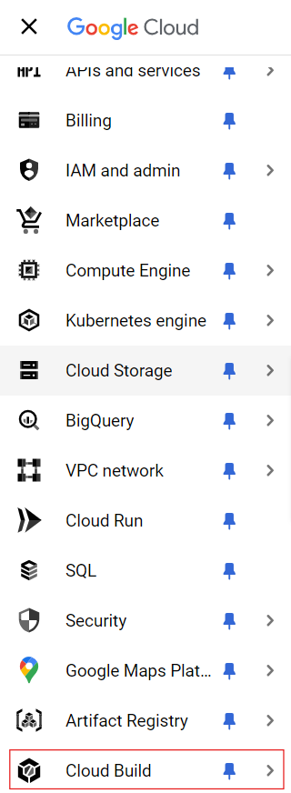
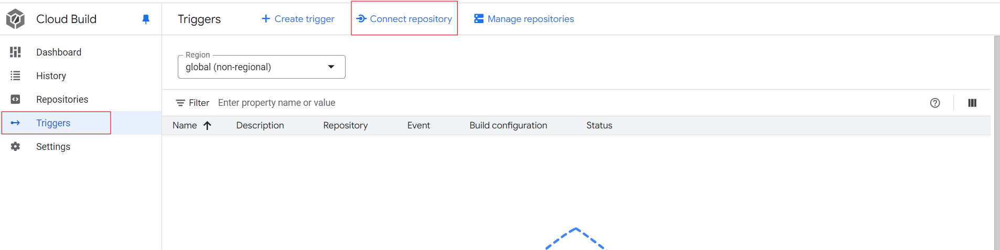
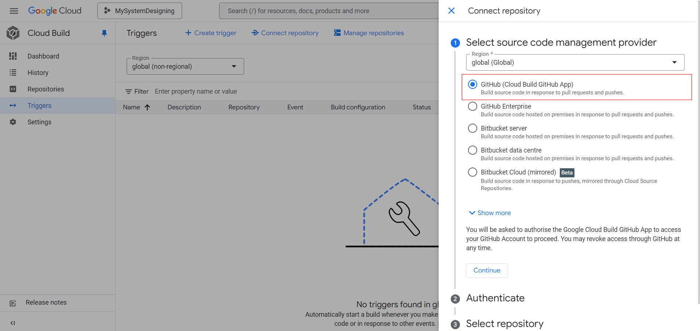
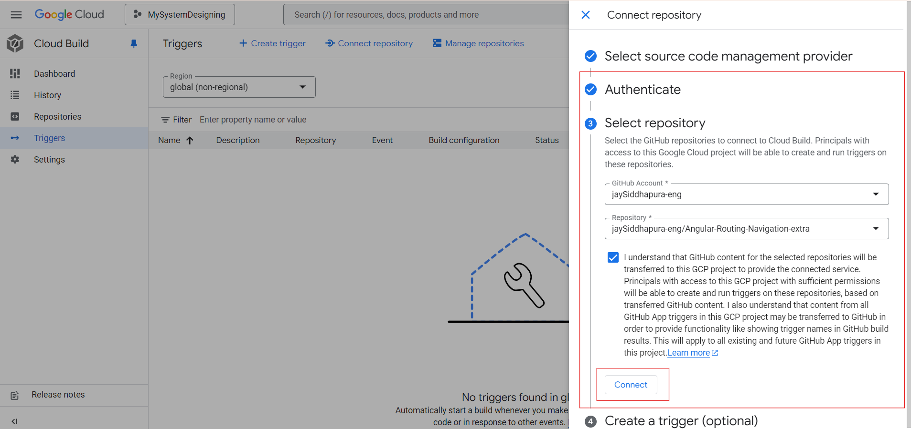
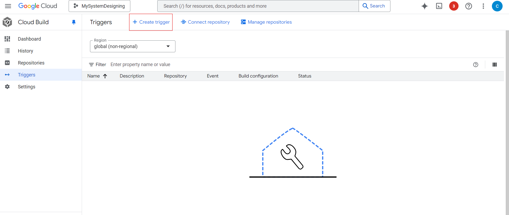
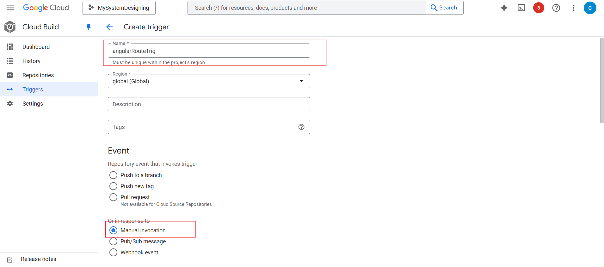
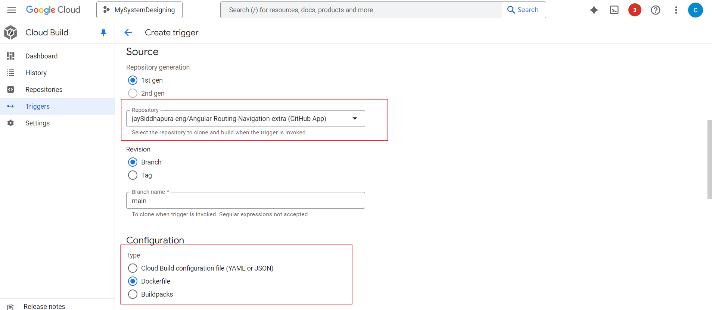
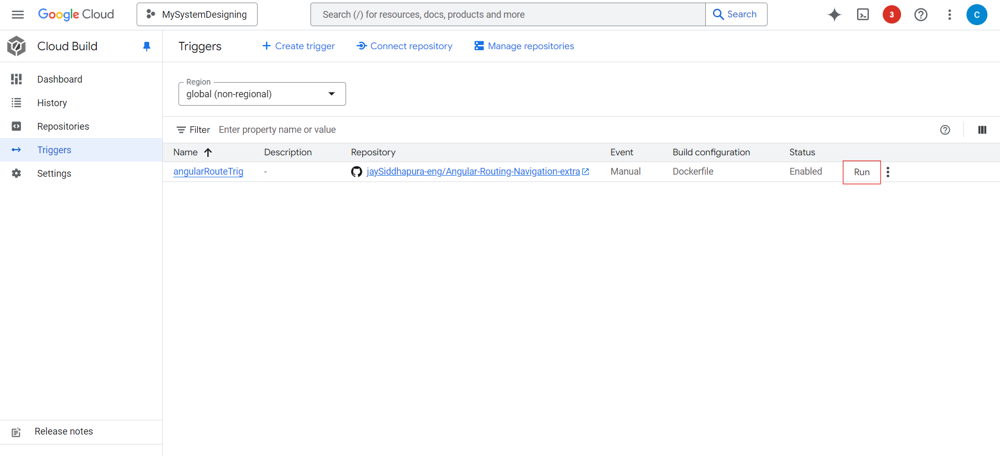
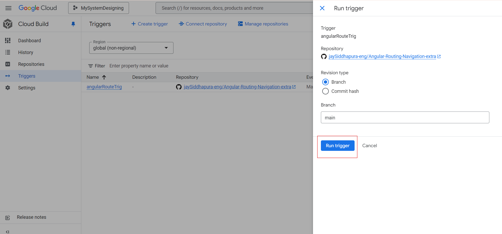

### Verify the image creation and storage in GCP's artifact registry
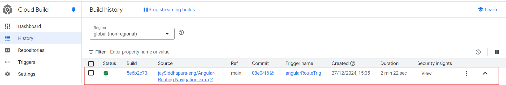
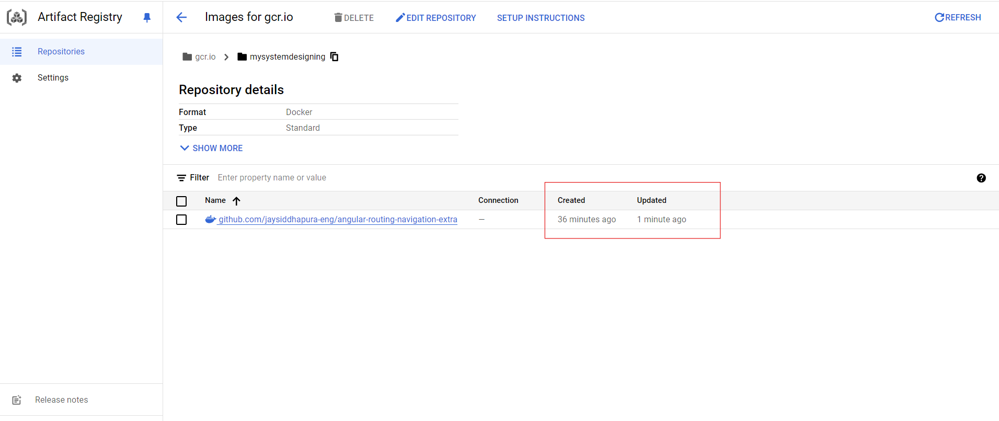

### Run the Docker container using GCP's Cloud Run
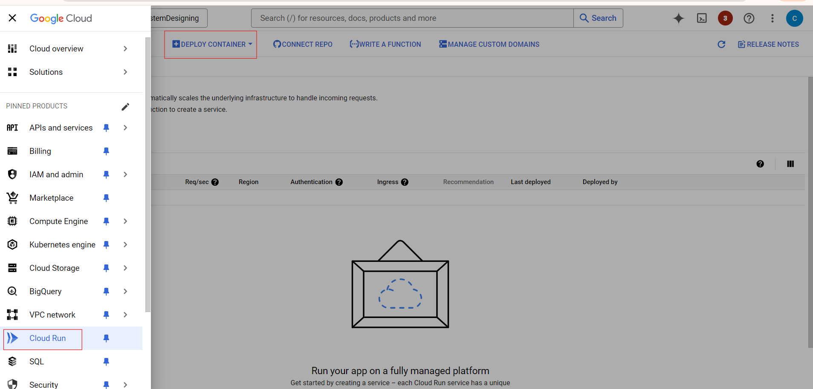
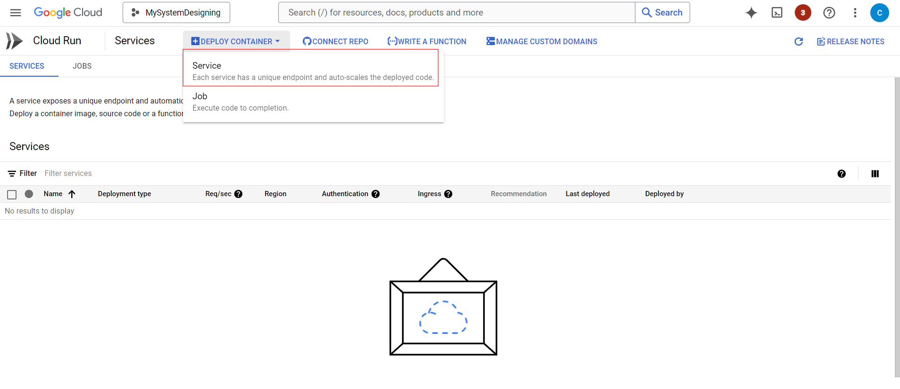
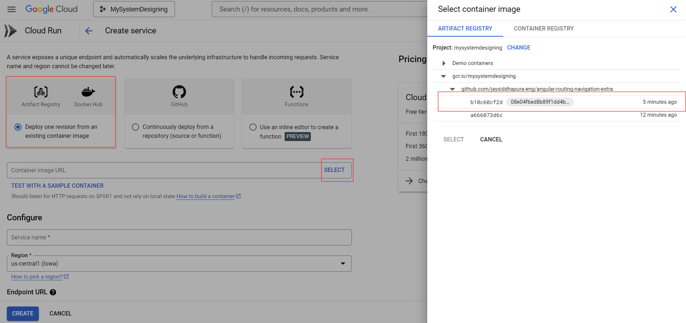
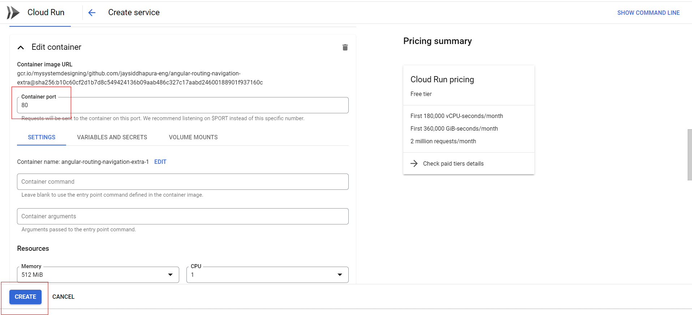
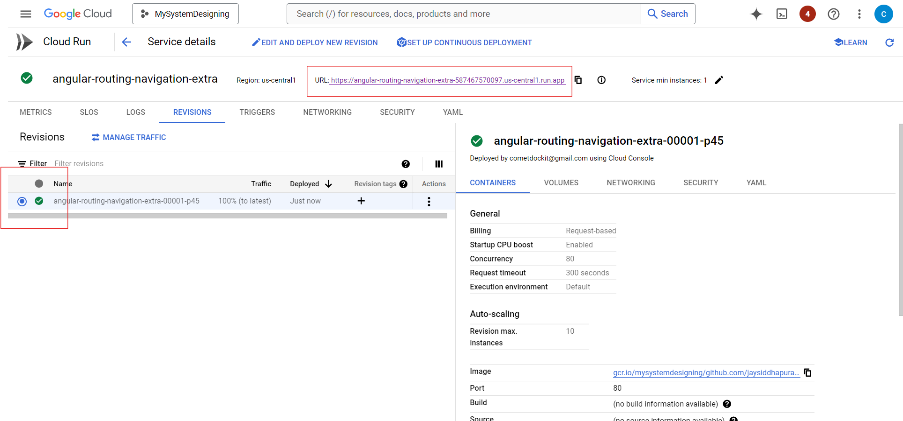
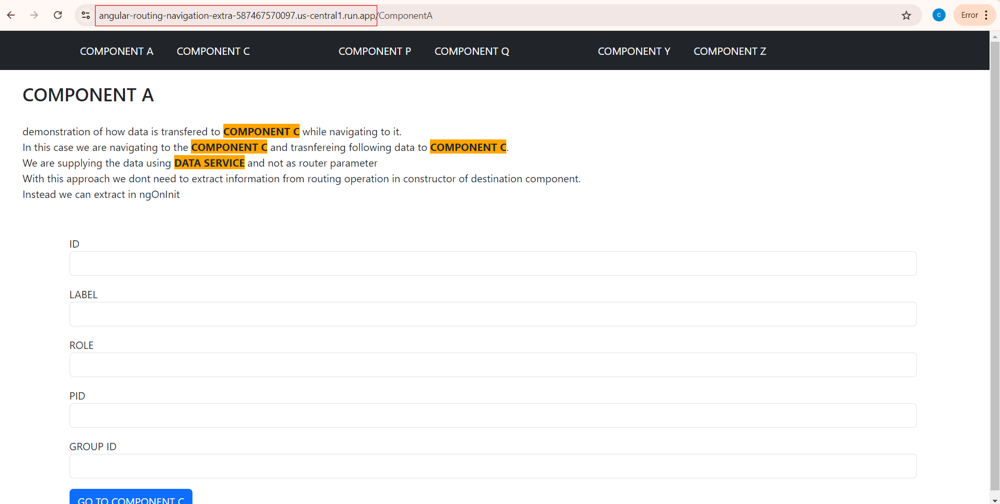


